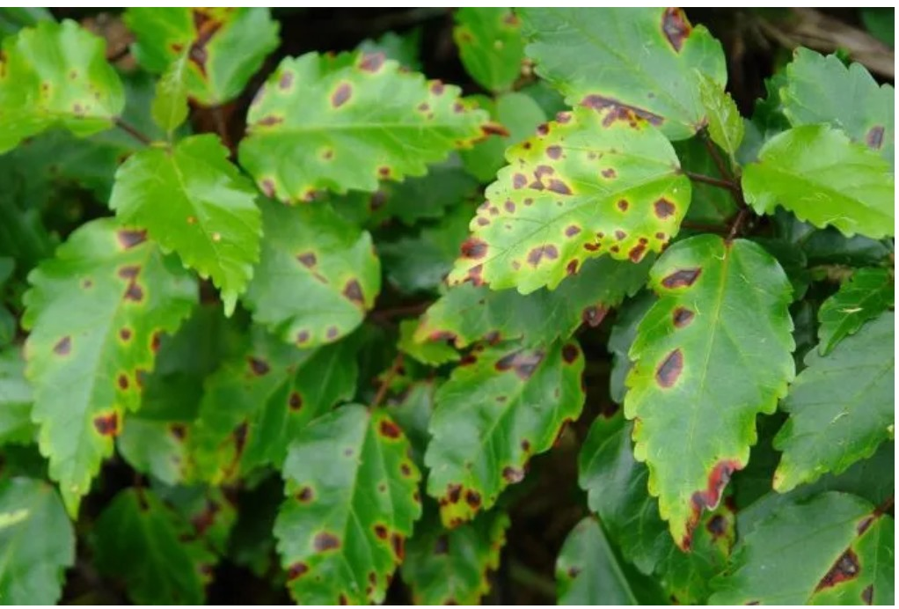

# Plant-diseases-detection
## Project Overview
This project aims to develop an automated tool for detecting plant diseases from leaf images. By leveraging the latest advancements in convolutional neural networks (CNNs), we have designed a model capable of precisely classifying the health status of various plants.
.

